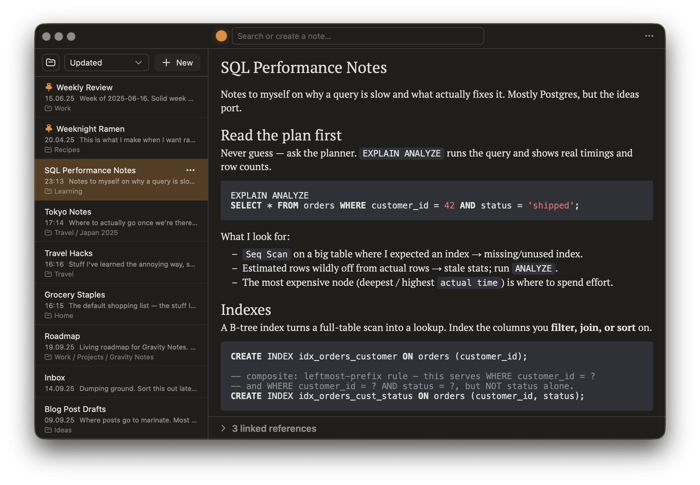

# Gravity Notes

A simple note-taking app built on the [Gravity UI](https://gravity-ui.com/) ecosystem,
using [`@gravity-ui/markdown-editor`](https://github.com/gravity-ui/markdown-editor) as the
WYSIWYG/Markdown editor. Runs as a **web app** and a **macOS desktop app** (Tauri). On first run you
choose where notes live: a **folder on your computer** (plain `.md` files), or **in-browser / in-app**
— and you can **export/import** `.md` files either way.

## Philosophy

The app does little, on purpose. There is one box — type, and you are reading the nearest note or
writing a new one, as in nvALT. The design takes after [Things](https://culturedcode.com/things/):
plain, quiet, out of the way. Every action has a key. The type is set to be read; the notes are plain
Markdown files, and they are yours.

<picture>
  <source media="(prefers-color-scheme: light)" srcset="assets/gravity-notes-light.png">
  
</picture>

## Features

- **Your notes are plain `.md` files** in a folder you own — or in-browser storage; export/import
  a zip either way
- **One box, keyboard-first** (nvALT-style): type to search or create, `Enter` to open, `Esc` to
  step back — every action has a key (`⌘/` for the sheet, or [docs/shortcuts.md](docs/shortcuts.md))
- **Gravity Markdown editor**: WYSIWYG and markup modes, read-only preview, live URLs
- **`[[Wiki links]]` and backlinks**, stored verbatim — Obsidian-compatible
- **Full-text search** across titles and bodies, ranked, with match snippets
- **Nested folders, pins, sort modes, note icons**, and a recoverable **Trash**
- **Images**: paste or drop into a note — stored as files in `Attachments/`, click to zoom
- **Plays nice with other tools**: external edits show up live in the desktop app (a folder
  watcher), with conflict handling when a note changes underneath you
- **Multiple workspaces & windows** (desktop): switch folders with `⌃R`, open a workspace — or a
  single note — in its own window
- **Make it yours**: light/dark/system theme, editor font, accent color, text width — app-wide,
  per workspace, or per note
- **Mobile-ready**: a single-pane list↔editor layout kicks in at ≤700px (phone, or a narrow
  desktop window); an **iOS app** opens an iCloud Drive (or on-device) folder of `.md` files through
  the native Files picker
- **Autosave**, visited-note history (`⌘[` / `⌘]`), and automatic signed updates in the macOS app

## Getting started

### Download the app (macOS)

Grab the latest `.dmg` from the
[releases page](https://github.com/resure/gravity-notes/releases/latest) (Apple silicon). The app
updates itself in place from there. On first run, pick **Open a folder** (plain `.md` files you
own) or **Store inside the app** — you can switch later, or export/import, from the storage menu
in the top bar.

### Run from source

You'll need Node.js. The desktop app additionally needs a Rust toolchain (**rustc ≥ 1.88**;
[rustup](https://rustup.rs) is recommended) and the Xcode Command Line Tools.

```bash
npm install
npm run dev          # start the dev server (http://localhost:5173)
npm run build        # type-check + production build
npm run build:single # single self-contained index.html (all JS/CSS inlined)
npm run preview      # preview the production build

npm run tauri:dev    # run the macOS desktop app against the dev server
npm run tauri:build  # build the .app / .dmg (arm64) → src-tauri/target/release/bundle
```

In the browser, any modern one works — but **folder storage** uses the
[File System Access API](https://developer.mozilla.org/en-US/docs/Web/API/File_System_API), which
is Chromium-only (Chrome, Edge, …) and re-prompts for permission each session; Firefox/Safari get
in-browser storage. The desktop app reads the folder natively, with no re-prompting.

## Documentation

- [docs/shortcuts.md](docs/shortcuts.md) — every keyboard shortcut (also `⌘/` in the app)
- [docs/architecture.md](docs/architecture.md) — how it's built, what's written to your disk,
  and known limitations

## Backlog

- Copy pasting wysiwyg should copy markdown, not formatted text
- Tune line-height
- Setting for disabling spellcheck

- iCloud dataless files: not-yet-downloaded files list by name/mtime with an empty preview/search
  body, and recover once macOS materializes them (a focus refresh picks up the filled-in preview).
  Consider `startDownloadingUbiquitousItemAtURL` to kick off downloads in the background + a
  "downloading…" preview state so it isn't silent.

- Density (line spacing) setting to complement the per-note font/width overrides?
- Restore all workspace windows on relaunch (today only the last-active one comes back)

- Preserve cmd+z between notes
- Cmd+z for undoing deleting of notes and moves between folders?

- Easter egg in top bar (to the right of the search bar) ?
- Notion-like page title backgrounds

- Auto-empty the Trash and clean unused attachments (after 30 days?)
- Metadata storage approach review
